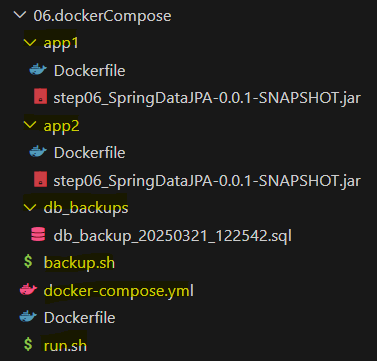
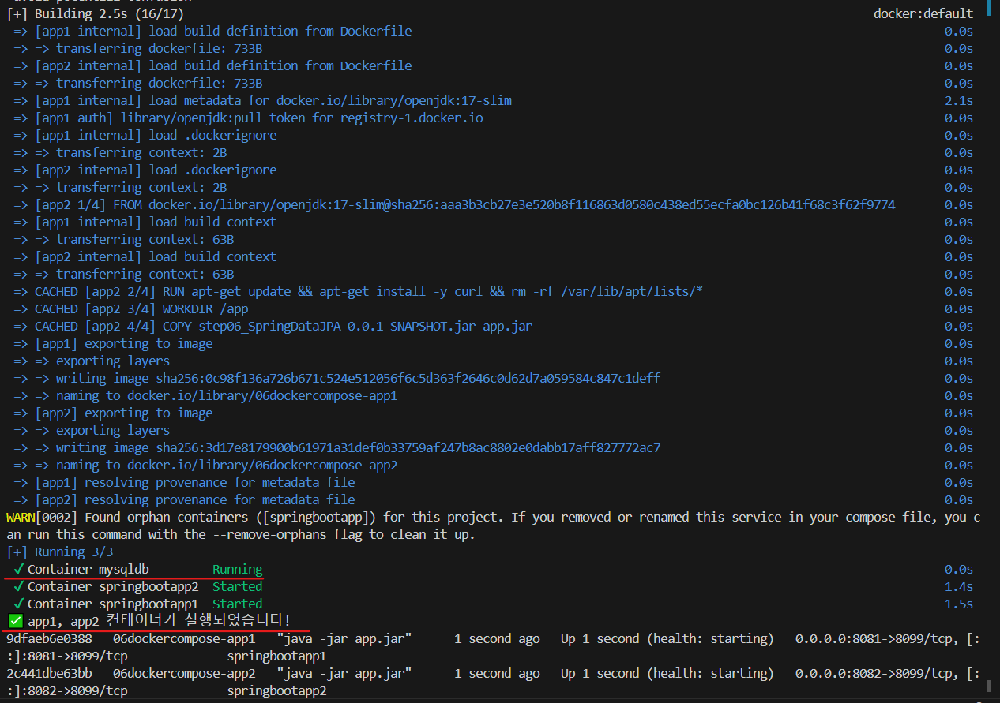

# OneDB_MultiApp

<br>

## 🎯 프로젝트 목표
- 하나의 MySQL 데이터베이스를 공유하는 두 개의 애플리케이션 <br>

- 두 개의 애플리케이션은 Docker 컨테이너로 패키징돼 실행됨 <br>

- 각 컨테이너는 **JAR 파일**과 **Dockerfile**을 포함, **Docker Compose**를 사용해 관리 <br>

- MySQL 데이터 자동 백업 기능 포함

<br>

## 📆 프로젝트 기간 (개인)
- 2025.03.21 ~ 

<br>

## ⚙ 실행 과정

### 1️⃣ Spring Boot 애플리케이션 구조
```
06.dockerCompose/
|
├── app1/
│   ├── step06_SpringDataJPA-0.0.1-SNAPSHOT.jar   
│   └── Dockerfile                                
│
├── app2/
│   ├── step06_SpringDataJPA-0.0.1-SNAPSHOT.jar   # app1과 동일한 기능
│   └── Dockerfile                                # app1과 동일한 기능
```
<br>

- **step06_SpringDataJPA-0.0.1-SNAPSHOT.jar** <br>
: Spring Boot로 빌드된 실행 파일. DB에 연결해 API 제공

- **Dockerfile** <br>
: JAR 파일을 기반으로 Java 컨테이너 이미지 생성 <br>

<br>

### 2️⃣ docker-compose.yml 파일 설정
```
06.dockerCompose/
|
├── app1/
│── app2/
|
|── docker-compose.yml
```
<br>

- 전체 서비스를 하나의 네트워크로 묶어 실행하고 관리하기 위한 설정 파일

- 이 프로젝트에서는 다음과 같은 세 가지 서비스를 정의
  - mysqldb : MySQL 데이터베이스 컨테이너
  - app1 : 첫 번째 Spring Boot 애플리케이션 (**8081 포트**)
  - app2 : 두 번째 Spring Boot 애플리케이션 (**8082 포트**)

<br>

### 3️⃣ run.sh 실행 스크립트
```
06.dockerCompose/
|
├── app1/
│── app2/
|── docker-compose.yml
|
|── run.sh
```

<br>

- docker-compose.yml 기반으로 모든 컨테이너를 한 번에 실행

    - 기존 컨테이너가 존재하면 먼저 종료한 뒤 재시작
    - 개발 및 테스트 환경에서 빠르게 초기화하고 실행하기 유용

<br>

### 4️⃣ backup.sh 백업 스크립트
```
06.dockerCompose/
|
├── app1/
│── app2/
|── docker-compose.yml
|── run.sh
|
├── db_backups/
├── backup.sh
```
<br>

- mysqldb 컨테이너의 데이터를 주기적으로 백업하는 스크립트

    - db_backups/ 폴더에 .sql 포맷으로 저장됨
    - 개발 중 데이터 유실 방지, 배포 전 스냅샷 저장 등에 활용 가능

<br>

### 5️⃣ 자동 백업 스케줄링
```
crontab -e

0 0 * * * /home/ubuntu/06.dockerCompose/backup.sh
```
<br>

- crontab을 이용해 정해진 시간마다 backup.sh 자동 실행 가능

<br>

## 📺 실행 결과
<br>

### 🔸 폴더 구조 (VSCode)



<br>

### 🔸 run.sh 실행 결과




<br>

### 🔸 Docker에서 실행 중인 컨테이너 확인


<br>

### 🔸 URL로 요청을 보내고 응답을 확인


- Spring Boot 코드에서 특정 메서드가 실행되지 않아 빈 리스트 [ ]가 반환됨

<br>

### 🔸 backup.sh 실행


<br>

### 🔸 MySQL DB의 현재 상태를 저장한 백업 파일

```
-- MySQL dump 10.13  Distrib 8.0.41, for Linux (x86_64)
--
-- Host: localhost    Database: fisa
-- ------------------------------------------------------
-- Server version	8.0.41

/*!40101 SET @OLD_CHARACTER_SET_CLIENT=@@CHARACTER_SET_CLIENT */;
/*!40101 SET @OLD_CHARACTER_SET_RESULTS=@@CHARACTER_SET_RESULTS */;
/*!40101 SET @OLD_COLLATION_CONNECTION=@@COLLATION_CONNECTION */;
/*!50503 SET NAMES utf8mb4 */;
/*!40103 SET @OLD_TIME_ZONE=@@TIME_ZONE */;
/*!40103 SET TIME_ZONE='+00:00' */;
/*!40014 SET @OLD_UNIQUE_CHECKS=@@UNIQUE_CHECKS, UNIQUE_CHECKS=0 */;
/*!40014 SET @OLD_FOREIGN_KEY_CHECKS=@@FOREIGN_KEY_CHECKS, FOREIGN_KEY_CHECKS=0 */;
/*!40101 SET @OLD_SQL_MODE=@@SQL_MODE, SQL_MODE='NO_AUTO_VALUE_ON_ZERO' */;
/*!40111 SET @OLD_SQL_NOTES=@@SQL_NOTES, SQL_NOTES=0 */;

--
-- Table structure for table `people`
--

DROP TABLE IF EXISTS `people`;
/*!40101 SET @saved_cs_client     = @@character_set_client */;
/*!50503 SET character_set_client = utf8mb4 */;
CREATE TABLE `people` (
  `age` int NOT NULL,
  `no` bigint NOT NULL,
  `people_name` varchar(255) DEFAULT NULL,
  PRIMARY KEY (`no`)
) ENGINE=InnoDB DEFAULT CHARSET=utf8mb4 COLLATE=utf8mb4_0900_ai_ci;
/*!40101 SET character_set_client = @saved_cs_client */;

--
-- Dumping data for table `people`
--

LOCK TABLES `people` WRITE;
/*!40000 ALTER TABLE `people` DISABLE KEYS */;
/*!40000 ALTER TABLE `people` ENABLE KEYS */;
UNLOCK TABLES;

--
-- Table structure for table `people_seq`
--

DROP TABLE IF EXISTS `people_seq`;
/*!40101 SET @saved_cs_client     = @@character_set_client */;
/*!50503 SET character_set_client = utf8mb4 */;
CREATE TABLE `people_seq` (
  `next_val` bigint DEFAULT NULL
) ENGINE=InnoDB DEFAULT CHARSET=utf8mb4 COLLATE=utf8mb4_0900_ai_ci;
/*!40101 SET character_set_client = @saved_cs_client */;

--
-- Dumping data for table `people_seq`
--

LOCK TABLES `people_seq` WRITE;
/*!40000 ALTER TABLE `people_seq` DISABLE KEYS */;
INSERT INTO `people_seq` VALUES (1);
/*!40000 ALTER TABLE `people_seq` ENABLE KEYS */;
UNLOCK TABLES;
/*!40103 SET TIME_ZONE=@OLD_TIME_ZONE */;

/*!40101 SET SQL_MODE=@OLD_SQL_MODE */;
/*!40014 SET FOREIGN_KEY_CHECKS=@OLD_FOREIGN_KEY_CHECKS */;
/*!40014 SET UNIQUE_CHECKS=@OLD_UNIQUE_CHECKS */;
/*!40101 SET CHARACTER_SET_CLIENT=@OLD_CHARACTER_SET_CLIENT */;
/*!40101 SET CHARACTER_SET_RESULTS=@OLD_CHARACTER_SET_RESULTS */;
/*!40101 SET COLLATION_CONNECTION=@OLD_COLLATION_CONNECTION */;
/*!40111 SET SQL_NOTES=@OLD_SQL_NOTES */;

-- Dump completed on 2025-03-21  6:27:18

```
- DB를 동일한 상태로 복원할 수 있도록 저장된 SQL 스크립트
    - 백업된 데이터베이스 : fisa
    - 백업된 테이블 : people, people_seq 